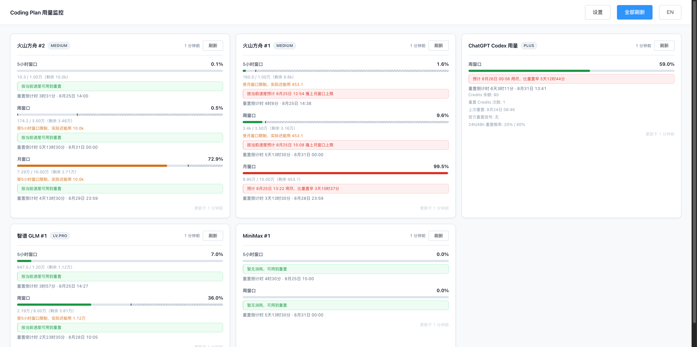

# Coding Plan Quota Watcher

English | [中文](./README.zh-CN.md)

[](https://github.com/petrel2015/coding-plan-quota-watcher/releases)
[](https://github.com/petrel2015/coding-plan-quota-watcher/stargazers)
[](https://developer.chrome.com/docs/extensions/)
[](https://vuejs.org/)
[](https://element.eleme.io/)
[](https://vitejs.dev/)
[](./test)

---

A Chrome browser extension (Manifest V3) that **monitors the usage quota of multiple AI Coding Plans in one unified Dashboard**. Usage information from scattered platforms is aggregated into a single panel, so you no longer need to log into each website one by one just to check "how much quota is left".

> **💡 Core Goal: All your Coding Plan quotas in one panel — know how much is left and when it resets, at a glance.**

## Screenshots

> Screenshots show demo data with the Chinese UI (the extension also supports English — toggle it in Settings).

**Dashboard (light theme)** — multi-platform usage aggregation, 3-level warning progress bars, reset countdown, and burn-rate prediction:


**Cross-window "ghost" effective cap** — when the weekly/monthly window has less quota left than the 5-hour window, the 5h progress bar shows a dashed wall + hatched locked region marking the real usable limit, and the burn-rate prediction is recalculated against it:



**Dashboard (dark theme)**:


**Settings** — data source management with auth mode (local cookie / manual cURL), plus column / theme / language preferences:


---

## Supported Data Sources

| Data source | Platform | What's monitored |
|-------------|----------|------------------|
| **Volcengine ARK Agent Plan** | console.volcengine.com | 5h / weekly / monthly rolling windows |
| **MiniMax Token Plan** | platform.minimaxi.com | Hourly + weekly windows |
| **ChatGPT Codex** | chatgpt.com | Weekly + secondary window + Credits + reset prediction |
| **Zhipu GLM** | bigmodel.cn | 5h + weekly windows |

## Features

- **Multi-platform aggregation**: view all plan usage in one panel
- **Progress bars with 3-level warnings**: green (<70%) / yellow (70–90%) / red (≥90%)
- **Cross-window effective cap ("ghost" HP bar)**: when a weekly/monthly window has less left than the 5-hour window, the 5h bar shows a dashed wall + hatched region marking the real usable limit, and burn-rate prediction is recalculated against that cap (Volcengine Ark & Zhipu GLM; MiniMax/Codex APIs only return percentages, so they are excluded)
- **Reset countdown**: real-time display of time until each window resets
- **Burn-rate prediction**: linear extrapolation of current consumption to estimate when quota runs out and whether it beats the reset
- **3 theme modes**: light / dark / follow system
- **Auto refresh**: background fetch every 5 minutes, plus manual single-card or full refresh
- **Retry & timeout handling**: a spinner running longer than 5s shows a "click to retry" link; 30s is treated as a timeout with a failure notice (never stuck spinning forever)
- **Login detection & local lock**: local-cookie instances report login state in real time; only the first instance of a type may use local cookie auth (the rest are locked to manual cURL)
- **Adjustable columns**: Dashboard supports 1/2/3-column layouts

## Install (Build & Load from Source)

The extension is bundled with Vite, and MV3 forbids remote CDN scripts, so you must build before loading.

```bash
git clone https://github.com/petrel2015/coding-plan-quota-watcher.git
cd coding-plan-quota-watcher
npm install          # install dependencies (Vue, Element-UI, Vite, ...)
npm run build        # build to dist/ (settings/dashboard/background + Element-UI CSS/fonts)
```

After building:

1. Open Chrome and visit `chrome://extensions/`
2. Enable "Developer mode" (top-right)
3. Click "Load unpacked" and **select the project root** (not dist/ — the directory containing manifest.json)
4. The extension icon appears in the toolbar; **click it to open the Dashboard panel**

> After changing code, just `npm run build` and click the "reload" button on the extension card in `chrome://extensions`.
> `build` automatically runs `sync-version` first (see below), keeping manifest.json's version in sync with package.json.

## Version Management

**Single source of truth**: the `version` field in `package.json`. `manifest.json`'s version is synced automatically by `scripts/sync-version.mjs` — **do not edit manifest.json's version by hand**.

For releases, use npm's built-in commands (bumps package.json and creates a git tag):

```bash
npm version patch   # 1.7.0 → 1.7.1 (bug fixes)
npm version minor   # 1.7.0 → 1.8.0 (new features)
npm version major   # 1.7.0 → 2.0.0 (breaking changes)
```

`npm version` runs the tests first (via the `preversion` hook) and only bumps the version, commits, and tags after they pass. Then use `npm run package` (below) to produce the zip for that version, and `git push --tags` to push the tag.

> You can bump the version manually, but after editing `package.json` be sure to run `npm run sync-version` to sync it into manifest.json; `npm run build` / `package` also sync automatically.

## Packaging as a Chrome Extension

### Option 1: One-command zip (recommended)

```bash
npm run package
```

One command does it all: sync version → `vite build` → zip into `releases/`. Artifact:

```
releases/coding-plan-quota-watcher-<version>.zip
```

The zip contains a **minimal loadable extension package** (`manifest.json` + `dist/` output + `icons/` + `*.html` + `common.css` + README files), automatically excluding `node_modules/`, `.git/`, `src/`, `test/`, `*.pem`, `*.crx` and other dev files. Cross-platform: uses the system `zip` on macOS/Linux and the built-in `tar` on Windows.

**Installing this zip**:

- **Developer-mode loading** (internal / small-scale distribution): unzip → `chrome://extensions` → enable "Developer mode" → "Load unpacked" → pick the unzipped directory.
- **Chrome Web Store listing**: visit the [Chrome Web Store Developer Dashboard](https://chrome.google.com/webstore/devconsole/), upload the zip directly, fill in the store info and submit for review.

### Option 2: Package as .crx (built into Chrome, requires a private key)

For scenarios that need `.crx` binary distribution with a fixed private key:

1. Run `npm run build` first (make sure `dist/` is up to date)
2. Open `chrome://extensions/`, enable "Developer mode"
3. Click "Pack extension"
4. **Extension root directory**: the project root path (the directory containing manifest.json, not dist/)
5. **Private key file**: leave empty the first time; Chrome generates `key.pem` automatically (keep it safe — later updates must use the same one)
6. Click "Pack extension" → `coding-plan-quota-watcher.crx` and `coding-plan-quota-watcher.pem` are generated in the **parent directory** of the project

> ⚠️ `.pem` is the extension's identity credential — **keep it safe and never commit it to git** (already excluded in .gitignore). If you lose it, you can't publish updates for the same extension; Chrome will treat it as a new extension.

## Configuring Data Sources

Click the "Settings" button in the top-right corner of the Dashboard to open the configuration page.

### Authentication (choose one)

**Option 1: Local cookie (automatic)**
- Just log in to the platform normally in your browser
- The extension reads the login state automatically via the `chrome.cookies` API
- Works when cookies are not partitioned

**Option 2: Paste a cURL manually**
- Open the platform's usage page
- Press F12 to open DevTools → Network tab
- Reload the page and find the usage request (request names in the table below)
- Right-click the request → Copy → **Copy as cURL**
- Paste into the `curl` input of the corresponding card on the settings page
- Works when cookie partitioning breaks automatic mode

| Platform | Request to find in Network |
|----------|---------------------------|
| Volcengine ARK | `GetAgentPlanAFPUsage` |
| MiniMax | `remains_percent` (+ optional `consumption_records` for the plan name) |
| ChatGPT | `wham/usage` |
| Zhipu GLM | `quota/limit` |

## Development

### Project structure

```
manifest.json          Extension manifest (service_worker points to dist/background.js)
vite.config.js         Vite config (multi-entry)
common.css             Shared design tokens (colors/radius/shadow, 3-theme CSS variables)
element-overrides.css  Element-UI dark-mode overrides
scripts/
├── sync-version.mjs   Version sync: package.json → manifest.json
└── package.mjs        One-command package: sync-version + build + zip → releases/
src/
├── settings/          Settings page (Vue 2 + Element-UI)
│   ├── main.js        Vue entry
│   ├── App.vue        Settings root component
│   └── InstanceCard.vue Data source card component
├── dashboard/         Dashboard page (Vue 2 + Element-UI)
│   ├── main.js        Vue entry
│   ├── App.vue        Dashboard root component
│   └── SourceCard.vue Usage card component
├── background/        Service worker
│   └── main.js        ES module: scheduled fetch, DNR injection, message dispatch
└── shared/            ES modules shared across pages
    ├── sources.js     Data source templates, default config, field migration
    ├── render.js      Normalization + burn-rate prediction
    ├── format.js      Formatting utilities (relative time/countdown/numbers)
    └── theme.js       3-theme switching
dashboard.html / settings.html  Page entries (reference dist output)
test/                  Unit tests (vitest)
dist/                  Build output (gitignored; generated by npm run build)
releases/              Package output (gitignored; generated by npm run package)
```

### Development workflow

```bash
npm install           # install dependencies
npm run build         # Vite build to dist/ (MV3 forbids remote scripts, must build locally)
# then chrome://extensions → Load unpacked → pick the project root
# after code changes re-run npm run build + click reload on the extension
```

> MV3 extension pages' CSP forbids remote CDN scripts and `unsafe-eval`, so Vue/Element-UI must be bundled locally (Vite compiles templates at build time, avoiding runtime compilation).

### Running tests

```bash
npm test            # run once
npm run test:watch  # watch mode
```

Tests cover `normalizeData` (normalization across the 4 data sources), `migrateInstances` (field migration), `generateInstanceName` (default name generation).

### Architecture notes

**Data flow**:
```
Platform API → background SW (DNR injects cookie) → storage.local → onChanged event → Vue reactive update
```

**Key technical points**:
- **declarativeNetRequest (DNR)**: the Service Worker's `fetch` doesn't carry cookies, so a DNR dynamic rule injects the `cookie` header right before the request. Each request uses a unique `_qwid` query param to match its rule, which is cleaned up immediately after.
- **Concurrent batch refresh**: `refreshAll` fetches all instances in parallel (`Promise.all`) — safe because each request allocates a unique DNR rule ID + `_qwid`, so rules never collide. Single-card refresh and test-connection still run through the `serializeFetch` lock.
- **Storage push**: the frontend doesn't poll — it listens to `chrome.storage.onChanged` for background writes, and Vue reactively updates the DOM.
- **Shared ES modules**: the background service worker uses `"type": "module"` and shares pure logic with the pages via `src/shared/`, with no duplication.

## Tech Stack

- Chrome Extension Manifest V3
- Vue 2.7 + Element-UI 2.15 (SFC, template compiled by Vite at build time)
- Vite 5 (multi-entry bundling)
- vitest (unit tests)
